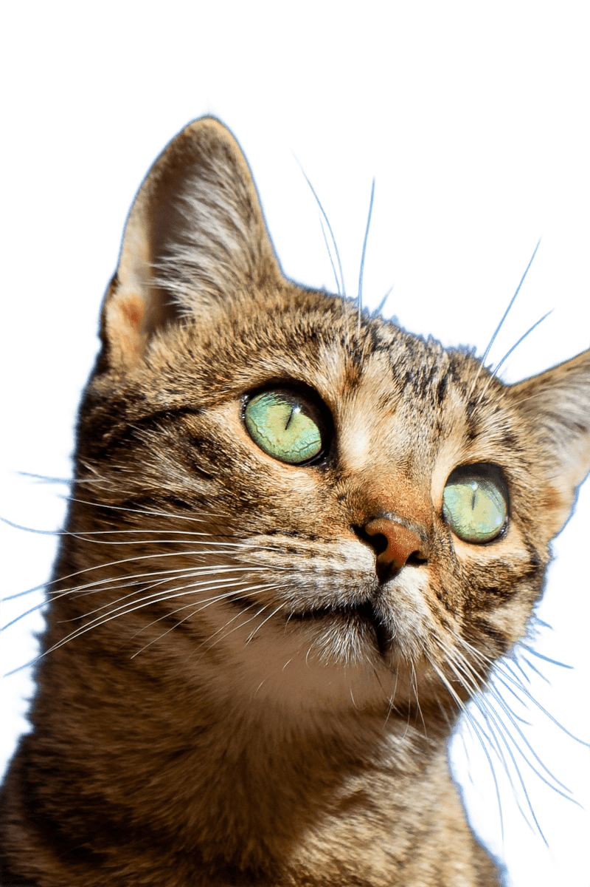

# Cabinet Vétérinaire Dr PAYRIERE — Site internet

## Description

Site internet professionnel pour le **Cabinet du Dr PAYRIERE**, vétérinaire à Saint-Paul-sur-Save (31530). Interface entièrement en français. Fonctionne en ouvrant `index.html` directement dans un navigateur (protocole `file://`) ou via le serveur de développement local.

Déployé en ligne sur GitHub Pages : **https://kewinherissard-oss.github.io/cabinet-payriere/**

---

## Architecture des fichiers

```
/
├── index.html               # Structure HTML complète (~589 lignes)
├── style.css                # Système de design complet (~1450 lignes)
├── app.js                   # Animations et interactions JS (~318 lignes)
├── chatbot.js               # Widget chatbot autonome IIFE (~1041 lignes)
├── Code.gs                  # Google Apps Script — copie de travail (sync avec apps-script/)
├── imagedr-payriere.jpg     # Photo active du Dr PAYRIERE (section équipe)
├── services-cat-nobg.png    # Photo active — chat tabby fond transparent (section services)
├── services-cat-raw.jpg     # Source Unsplash du chat services (photo-1574158622682-e40e69881006)
├── puce avatar2.png         # Avatar actif de Puce (chaton noir et blanc, yeux dorés)
│
├── — Fichiers non utilisés —
├── puce-avatar.svg          # Version SVG de l'avatar Puce
├── puce avatar.png          # Ancienne version avatar
├── puce-avatar.png          # Ancienne version avatar
├── puce-original.png        # Version originale avatar
├── puce.jpg                 # Photo source Puce
├── avatar puce2.png         # Fichier doublon haute résolution
├── Maine coon leve patte.jpg # Photo locale non trackée
├── Tic et puce hero.jpg     # Photo locale non trackée
├── tic-puce-hero.png        # Photo locale non trackée
├── cat-guide-raw.jpg        # Source (tentative chat debout, abandon)
├── cat-guide.png            # Traitement bg-removal (tentative abandon)
├── cat-services.png         # Chat debout fond transparent (tentative abandon)
├── cat-sit-raw.jpg          # Source alternative (non utilisée)
│
├── — Scripts utilitaires Node.js —
├── process-cat.mjs          # Télécharge l'image Unsplash + suppression de fond → services-cat-nobg.png
├── remove-bg.mjs            # Suppression fond générique (cat-guide-raw → cat-services.png)
├── gen-cat.mjs              # Tentative génération IA Gemini/Imagen (non fonctionnel, tier gratuit)
├── package.json             # Dépendance : @imgly/background-removal-node ^1.4.5
├── package-lock.json
├── node_modules/            # Non tracké dans Git
│
├── CLAUDE.md                # Ce fichier
├── apps-script/
│   ├── Code.gs              # Script déployé sur Google Apps Script (clasp)
│   └── appsscript.json      # Manifest Apps Script (webapp, timezone Europe/Paris, V8)
├── .claude/
│   ├── launch.json          # Config serveur de développement (npx serve, port 3001)
│   └── settings.local.json
└── .gitignore
```

Dépôts Git :
- `origin` → `kewinherissard-oss/mon-budget` (ancien projet, ne pas modifier)
- `payriere` → `kewinherissard-oss/cabinet-payriere` (dépôt actif du site vétérinaire)

---

## Technologies

- **HTML5** — structure sémantique, pas de framework
- **CSS3** — variables CSS, flexbox, grid, responsive mobile-first
- **JavaScript ES6+** — vanilla JS, IIFEs, `requestAnimationFrame`, Canvas 2D
- **GSAP 3.12.5 + ScrollTrigger** — chargé via CDN, uniquement pour les animations au scroll
- **Google Apps Script** — webhook serverless déployé pour l'automatisation des RDV
- **ntfy.sh** — push notifications instantanées vers le Dr PAYRIERE à chaque RDV
- **@imgly/background-removal-node** — suppression de fond IA locale (Node.js, scripts `.mjs`)

> Aucune autre bibliothèque tierce côté site. Pas de bundler, pas de build step.

---

## Structure des sections (index.html)

| Ordre | ID / Classe | Contenu |
|-------|-------------|---------|
| 1 | `header` | Navigation fixe — logo, liens (Accueil, Services, L'équipe, Avis, Boutique, Contact), bouton **Prendre RDV** glass amber |
| 2 | `#accueil` `.hero` | Hero plein écran full-bleed — photo chien+chat en fond, overlay navy, canvas étoilé, titre, deux CTAs glass côte à côte |
| 3 | bandeau confiance | 5 points clés (soins, urgences, équipe, matériel, accessibilité) |
| 4 | `#pmarqueeSection` | PerspectiveMarquee — défilement 3D animé en JS natif |
| 5 | `.animal-parade` | Défilé de 5 espèces avec photos rondes (Chiens, Chats, Lapins, Rongeurs, Furets & NAC) |
| 6 | `.gallery` | Strip galerie 4 photos réelles d'animaux (Unsplash) |
| 7 | `#services` `.dark-bg` | 3 colonnes : intro+2 cartes gauche, **photo chat PNG transparent central**, 2 cartes droite + carte large Dentisterie en bas |
| 8 | `#equipe` `.about` | Fond navy bleu vif avec orbes 3D et empreintes flottantes — carte Dr PAYRIERE avec tilt 3D, biographie, diplômes |
| 9 | `.philosophie` `.dark-bg` | Phytothérapie en priorité, stérilisation chat ✅, stérilisation chien par implant Suprelorin® |
| 10 | `#temoignages` | **5 vrais avis Google** — 2 rangées de marquee CSS en défilement automatique (gauche ↔ droite), pause au survol |
| 11 | `#boutique` `.dark-bg` | ChronoVet — point relais officiel, liste produits, bouton vers chronovet.fr |
| 12 | `#contact` `.dark-bg` | Adresse, téléphone, email, urgences Vet-Urgentys, tableau horaires |
| 13 | `footer` | Navigation, copyright, slogan |

---

## Système de design (style.css)

### Variables CSS principales

```css
:root {
  --primary:       #2563eb;  /* Bleu royal vif */
  --primary-light: #dbeafe;
  --primary-dark:  #1d4ed8;
  --accent:        #f59e0b;  /* Or */
  --accent-dark:   #d97706;
  --accent-light:  #fef3c7;
  --dark:          #0c2461;  /* Marine profond */
  --text:          #1e293b;
  --text-muted:    #64748b;
  --bg:            #f8fafc;
  --surface:       #ffffff;
  --border:        #e2e8f0;
  --radius:        14px;
  --shadow-sm / --shadow-md / --shadow-lg
  --transition:    .25s ease;
}
```

### Patterns visuels utilisés

- **Hero full-bleed** — image chien+chat (`photo-1450778869180-41d0601e046e`) en `background: right center / cover`, overlay gradient navy gauche → transparent droite via `::before`, fondu bas via `::after`
- **Boutons glass** — `.btn-primary` amber glass `rgba(245,158,11,.18)` + `backdrop-filter: blur(14px)` + bordure amber ; `.btn-secondary` blanc glass `rgba(255,255,255,.1)` + bordure blanche
- **Navbar glass** — `.btn-rdv` glass amber au top, solid amber au scroll ; header glassmorphisme transparent, blanc opaque au scroll
- **Dark-bg sections** — classe `.dark-bg` partagée sur Services, Philosophie, Boutique, Contact : `linear-gradient(160deg, #0c2461 0%, #1d4ed8 55%, #0e3494 100%)` + grille dots `38px × 38px` via `::before` + orbe animé bleu `blur(60px)` via `::after`
- **Section Équipe custom** — fond `linear-gradient(160deg, #0c2461 0%, #1d4ed8 55%, #0e3494 100%)` avec `.about-bg-orb` (orbes glowing) + `.about-bg-paw` (empreintes flottantes) + tilt 3D sur la carte photo
- **Section Services** — fond `.dark-bg`, colonne centrale avec `services-cat-nobg.png` (PNG transparent, `object-fit: contain`, `drop-shadow` or + noir) qui flotte naturellement sur le navy
- **Photo Dr PAYRIERE** — `imagedr-payriere.jpg`, `object-fit: cover; object-position: center top;`
- **Chat services** — `services-cat-nobg.png`, chat tabby yeux verts, fond supprimé avec `@imgly/background-removal-node`, flotte sur le dark-bg
- **Glassmorphisme cartes dark** — `background: rgba(255,255,255,.12)`, `border: rgba(255,255,255,.11)`, sections sombres uniquement
- **Typography** — `clamp()` pour les titres, `font-weight: 900` sur les headings, `letter-spacing: -.03em`
- **Unsplash CDN** — photos animaux `?w=&h=&fit=crop&q=80`
- **Section Témoignages** — fond `var(--primary)` (bleu vif), 2 rangées de marquee défilantes (`@keyframes tmScroll`) avec cartes blanches, fades gauche/droite, pause au hover

### Classes CSS notables

| Classe | Rôle |
|--------|------|
| `.btn-primary` | Bouton CTA principal — glass amber, `blur(14px)`, hover glow |
| `.btn-secondary` | Bouton CTA secondaire — glass blanc, `blur(14px)` |
| `.btn-rdv` | Bouton nav "Prendre RDV" — glass au top, solid amber au scroll |
| `.dark-bg` | Fond navy partagé (Services, Philo, Boutique, Contact) |
| `.about-bg-orb-1/2/3` | Orbes glowing animés dans la section Équipe |
| `.about-bg-paw` | Empreintes 🐾 flottantes avec `@keyframes` fade |
| `.about-card-wrapper` | `perspective: 900px` pour le tilt 3D |
| `.about-card` | Carte photo 3D — `transform-style: preserve-3d`, `will-change: transform` |
| `.hero-content` | `margin-left: 8vw; max-width: 600px` — contenu hero aligné gauche |
| `.hero-cta` | Flex row des deux boutons CTA hero |
| `.hero-tag` | Badge doré "Cabinet vétérinaire de confiance" |
| `.services-guide-cat` | Image chat central services — `object-fit: contain`, `drop-shadow` |
| `.tm-outer` | Conteneur marquee avis — `overflow: hidden`, fades L/R |
| `.tm-track--left` | Rangée 1 avis — animation `tmScroll` 34s normale |
| `.tm-track--right` | Rangée 2 avis — animation `tmScroll` 34s `reverse` |
| `.tm-card` | Carte avis blanche 300px — hover lift |
| `.tm-fade-l / .tm-fade-r` | Dégradé fondu bords du marquee (couleur `var(--primary)`) |
| `#cb-root` | Widget chatbot fixe, z-index 1100 (au-dessus du header à 1000) |
| `#cb-bubble` | Bouton FAB avec avatar Puce, animation pulse dorée |
| `#cb-panel` | Fenêtre chat — `rgba(10,15,46,.92)` + `blur(22px)` |
| `.cb-slot-picker` | Sélecteur créneaux style Doctolib |
| `.cb-slot-btn` | Bouton créneau individuel, état sélectionné doré |

### Responsive — breakpoints

| Breakpoint | Changements principaux |
|------------|------------------------|
| `960px` | Hero centré, nav mobile (burger), grilles services en colonne, contact en colonne |
| `600px` | Nav mobile `.open`, trust-bar en colonne, services une colonne |

---

## Animations JavaScript (app.js)

### 1. Marquee Témoignages (`initTestimonialMarquee`)
S'exécute en premier (top du fichier). Duplique les enfants de chaque `.tm-track` pour créer une boucle CSS infinie — la CSS animation prend le relais sans JS continu.

### 2. Burger menu & header scroll
Burger toggle `.open` sur `.nav-links`. Header ajoute `.scrolled` après 60px de scroll.

### 3. Canvas particules (`initCanvas`)
Fond étoilé animé dans le hero. 110 points qui bougent et scintillent via `requestAnimationFrame` sur `<canvas id="heroCanvas">`. Chaque dot : position, rayon, alpha oscillant, vélocité X/Y.

### 4. Parallax souris (`initMouseParallax`)
Écoute `mousemove` sur la section hero, cherche les `.p-layer[data-depth]`. Actuellement aucun `.p-layer` dans le hero (code conservé pour usage futur). Lerp `cx += (mx - cx) * 0.08`.

### 5. PerspectiveMarquee (`initPerspectiveMarquee`)
Défilement de texte en 3D (rotateX + rotateY + perspective CSS). Items : `['Chiens', 'Chats', 'Lapins', 'Rongeurs', 'Vaccins', 'Chirurgie', 'Santé']`. Blur et opacité calculés par item selon distance au centre.

### 6. Tilt 3D carte Dr PAYRIERE (`initAboutTilt`)
Écoute `mousemove` sur `.about-card-wrapper` → applique `rotateY/rotateX` sur `.about-card` via `requestAnimationFrame`. Interpolation douce avec facteur `0.1`. `translateZ` proportionnel à la magnitude du tilt. Reset au `mouseleave`.

### 7. GSAP ScrollTrigger (sur `window.load`)
- **Header** — slide-down : `from('.header', { y:-80, opacity:0, duration:.7 })` en tête du timeline
- **Entrée héro** — séquence : header → tag → titre → sous-titre → emojis animaux → boutons CTA (stagger 0.14s, `fromTo` + `clearProps:'all'`)
- **Parallax scroll** — `.p-layer[data-depth]` (réservé, pas d'éléments actuellement)
- **Fade-out hero** — `.hero-content` s'efface au scroll (`center top → bottom top`)
- **Animal parade** — stagger `back.out(1.5)` au scroll
- **Cartes** — `[data-gsap-card]` : `opacity:0 → 1, y:30 → 0` par tranche de 3 (delay `i%3 * 0.12`)
- **Sections** — `[data-gsap-reveal]` : `opacity:0 → 1, y:40 → 0` au scroll

---

## Chatbot assistant virtuel "Puce" (chatbot.js)

Widget IIFE autonome (~1041 lignes) injecté dans `document.body`, aucune dépendance, aucun conflit avec `app.js`.

### Avatar
Fichier `puce avatar2.png` — chaton noir et blanc aux yeux dorés. Affiché dans le bouton FAB et dans le header du panel chat.

### Architecture DOM générée

```
#cb-root (position:fixed, bottom:24px, right:24px, z-index:1100)
  ├── #cb-greet         ← bulle de salutation animée avec patte
  ├── #cb-bubble        ← bouton FAB avec avatar Puce, animation pulse
  └── #cb-panel         ← fenêtre chat (glassmorphisme navy)
        ├── .cb-header  ← avatar + "Puce 🐱 — Cabinet Dr PAYRIERE" + statut vert + ✕
        ├── .cb-messages ← bulles scrollables (bot/user)
        ├── .cb-quick   ← chips suggestions contextuelles
        └── .cb-input-row ← champ texte + bouton envoi doré
```

### Moteur de réponses (NLP léger)
- **Normalisation** : lowercase + suppression accents
- **Scoring pondéré** : `hits × priority` — seuil configurable par règle
- **75 règles** couvrant : horaires (par jour), adresse, téléphone, email, services, espèces, urgences, vaccination, stérilisation, phytothérapie, boutique, domicile, ostéopathie, avis, tarifs, comportement, antiparasitaires, identification, adoption, voyage, animal trouvé/perdu, assurance, dentisterie, chirurgie, fallback

### Sélecteur de créneaux (style Doctolib)

Le slot picker remplace les chips textuelles à l'étape "créneau" :
- `generateDays(20)` — génère côté client les 20 prochains jours ouverts (Lun/Mer/Ven)
- Rendu : jours dépliables avec grille de créneaux matin (9h30–12h00) et après-midi (15h00–18h30)
- Pagination "Voir plus" par blocs de 3 jours
- À la sélection : stocke `bookingData.dateISO` (ISO 8601) et `bookingData.date` (label lisible)
- `getAvailableSlots()` dans Code.gs : filtre côté serveur sur Google Calendar (28 jours) — endpoint `?action=slots`, non appelé par défaut (génération côté client)

### Flux de prise de RDV (bifurqué)

```
Étape 0 → Déjà client ?
  ├── CLIENT EXISTANT (5 étapes)
  │     1. Nom
  │     2. Téléphone
  │     3. Animal (chips espèces, emoji strippé avant stockage)
  │     4. Créneau (slot picker Doctolib)
  │     5. Motif → sendWebhook() → récap → actions post-RDV
  │
  └── NOUVEAU CLIENT (6 étapes)
        1. Nom
        2. Téléphone
        3. Email (ou "passer")
        4. Animal (chips espèces, emoji strippé avant stockage)
        5. Créneau (slot picker Doctolib)
        6. Motif → sendWebhook() → récap → actions post-RDV
```

- Saisie `annuler` / `stop` à n'importe quelle étape → retour au chat libre
- Actions post-RDV : bouton mailto structuré, bouton tel:, bouton "Nouvelle demande"

### Envoi des données RDV

```js
const WEBHOOK_URL = 'https://script.google.com/macros/s/AKfycbxbpM-4eLwtqComh3X8n22vxuuVMzNzdQ1sY2QTPsPcOgL2a2I_PhU5Bl29ttp9anM6/exec';
const NTFY_TOPIC  = 'rdv-cabinet-payriere-31530';
```

`sendWebhook(data)` déclenche deux appels en parallèle :
1. `fetch(WEBHOOK_URL + params, { mode: 'no-cors' })` → Google Apps Script (email + Calendar)
2. `fetch('https://ntfy.sh/' + NTFY_TOPIC, { method: 'POST', ... })` → push notification instantanée

---

## Automatisation RDV — Google Apps Script (Code.gs)

Déployé sur https://script.google.com avec le compte **mpayriere.vet@gmail.com**. Runtime V8, timezone Europe/Paris.

### Endpoints

**`doGet(e)` — point d'entrée unique**
- `?action=slots` → `getAvailableSlots()` — retourne les créneaux libres au format JSON
- Tout autre paramètre → `createRDV(p)` — crée le RDV

### `getAvailableSlots()`

1. Récupère tous les événements Google Calendar sur les 28 prochains jours
2. Génère tous les créneaux possibles (Lun/Mer/Ven, 9h30–12h00 et 15h–18h30, par tranche de 30 min)
3. Filtre les créneaux déjà occupés
4. Retourne `{ status: 'ok', days: [{ iso, slots }] }` — max 15 jours avec créneaux libres

### `createRDV(p)`

1. **Nettoie le champ `animal`** : supprime les emojis/caractères hors ASCII+latin avec `replace(/[^\x20-\x7EÀ-ɏ]/g, '')`
2. **Parse la date** : format ISO prioritaire (`YYYY-MM-DDTHH:MM`) puis `parseDate()` pour le texte ("Lundi matin")
3. **Crée un événement Google Calendar** — titre `RDV - animal - nom`, durée 30 min, description complète
4. **Envoie un email au Dr PAYRIERE** (`mpayriere.vet@gmail.com`)
5. **Envoie un email de confirmation au client** (si email fourni)

### Déploiement via clasp

```bash
cd apps-script
clasp login          # OAuth avec mpayriere.vet@gmail.com
clasp push
clasp deploy --description "description de la version"
clasp deployments    # vérifier l'URL de déploiement
```

---

## Témoignages — Vrais avis Google

5 avis affichés en double dans 2 rangées de marquee (10 cartes par rangée après duplication JS) :

| Auteur | Étoiles | Date | Résumé |
|--------|---------|------|--------|
| Léa L. | ⭐⭐⭐⭐⭐ | Mars 2025 | Urgence chat, très pro, attentionnée, réactive |
| Christopher B. | ⭐⭐⭐⭐⭐ | Déc. 2024 | Suivi lapin + pomsky, très à l'écoute, disponible |
| Florence D. | ⭐⭐⭐⭐⭐ | Déc. 2018 | Approche naturelle, veto en or et passionnée |
| M. L. Chargé | ⭐⭐⭐⭐⭐ | Oct. 2019 | Passionnée, parmi les meilleures rencontrées |
| Jennifer N. | ⭐⭐⭐⭐⭐ | Mars 2019 | Ostéopathie, acupuncture, fleurs de Bach |

---

## Informations du cabinet

- **Nom** : Cabinet du Dr PAYRIERE
- **Adresse** : 3 impasse des Coquelicots, Saint-Paul-sur-Save, 31530
- **Téléphone** : 05 61 49 27 99
- **Email RDV** : mpayriere.vet@gmail.com
- **Urgences** : Vet-Urgentys — 05 61 11 21 31 — https://vet-urgentys.fr
- **Horaires** : Lun / Mer / Ven 9h30–12h30 et 15h–19h | Mar / Jeu : visites à domicile | Sam / Dim : fermé
- **Espèces** : Chiens, Chats, Lapins, Rongeurs, NAC
- **Boutique** : Point relais ChronoVet officiel (chronovet.fr)

---

## Conventions de code

- Interface entièrement en **français**
- **Aucune bibliothèque tierce** côté site sauf GSAP (CDN, animation uniquement)
- **Aucun commentaire** dans le code sauf les blocs de séparation `/* ══ */` et `/* ── */`
- JS organisé en **IIFEs** autonomes
- CSS organisé par composant avec commentaires séparateurs `/* ── */`
- Images animaux proviennent d'**Unsplash** via CDN — photo Dr PAYRIERE en **fichier local** (`imagedr-payriere.jpg`)
- Photo chat section services : **fichier local** `services-cat-nobg.png` (PNG transparent généré avec `@imgly/background-removal-node`)
- Avatar Puce : **fichier local** `puce avatar2.png`
- Responsive **mobile-first**, breakpoints principaux à 960px et 600px
- Emojis **jamais stockés dans les données métier** (strippés avant envoi webhook et dans Code.gs)
- Boutons contextuels : glass dans les sections sombres (hero, dark-bg), solid amber sur fond clair

---

## Suppression de fond — workflow Node.js

Pour retravailler la photo du chat central (services) :

```bash
node process-cat.mjs
# → Télécharge depuis Unsplash photo-1574158622682-e40e69881006
# → Supprime le fond avec @imgly/background-removal-node (modèle medium)
# → Sauvegarde services-cat-nobg.png (PNG transparent)
```

L'image est ensuite utilisée directement dans `index.html` :
```html

```

CSS associé (`.services-guide-cat`) :
```css
width: 100%;
max-width: 320px;
object-fit: contain;
filter:
  drop-shadow(0 0 28px rgba(245,158,11,.12))
  drop-shadow(0 12px 48px rgba(0,0,0,.55));
```

---

## Serveur de développement

```bash
npx serve -p 3001 .
# Puis ouvrir http://localhost:3001
```

> Le fichier `.claude/launch.json` configure le serveur sur le port 3001 avec `autoPort: true`.

## Déploiement site

```bash
git add .
git commit -m "description"
git push payriere main
# Forcer rebuild GitHub Pages si nécessaire :
gh api repos/kewinherissard-oss/cabinet-payriere/pages/builds --method POST
```

---

## Historique des évolutions notables

| Commit | Changement |
|--------|-----------|
| session juin 2026 | Section services — chat tabby PNG transparent (`services-cat-nobg.png`) sur fond dark-bg |
| session juin 2026 | Section témoignages — refonte en marquee CSS 2 rangées défilantes (gauche + droite) |
| `7f3df58` | Animation marquee avis Google style 21s.dev |
| `d7de4de` | Slot picker style Doctolib — créneaux visuels par jour dans le flux RDV |
| `8c74d45` | Fix slot picker timing — injection post-message, scrollBottom correct |
| `9a21299` | Intégration Google Calendar — créneaux réels filtrés |
| `2d0eca0` | Hero redesign — suppression orbes animaux |
| `f8b14bb` | Hero plein écran full-bleed — image background chien+chat + overlay gauche |
| `dad121d` | Section équipe — fond navy 3D, orbes animés, tilt carte |
| `14e028d` | Dark-bg pour services, philosophie, boutique, contact + fix photo Dr |
| `a17c276` | Boutons glass (AnimatedHero), animation header slide-down, CTAs côte à côte |
